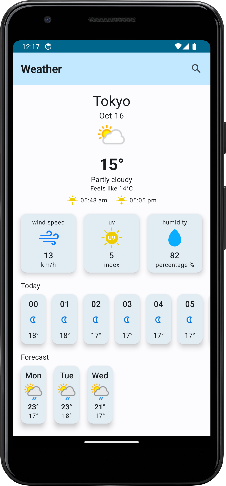
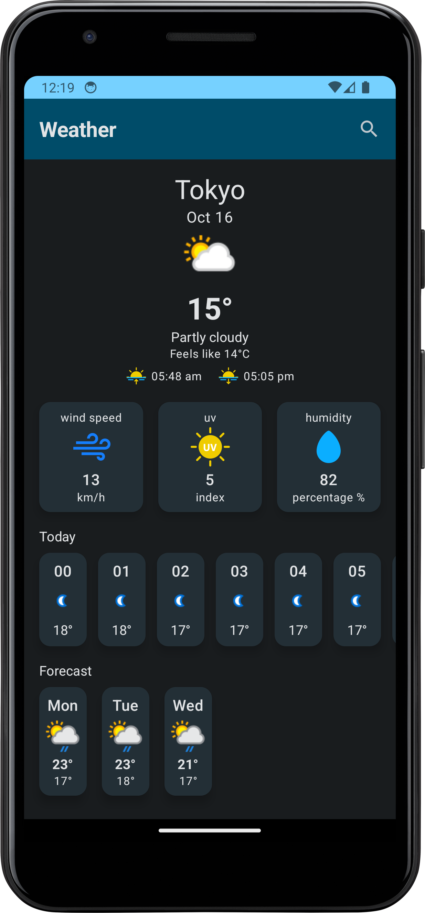

# ⛅ Weather App — Jetpack Compose

A weather forecasting Android application built with **Jetpack Compose**, fetching live data from the **OpenWeatherMap API**. Users can search any city and instantly view its current weather conditions.


---

## 📱 Overview

A focused, single-screen weather app that demonstrates clean network integration in a Compose-based Android app — from API call to reactive UI update — using a layered MVVM + Repository architecture.

## 🖼️ Screenshots

| Default City | Search Result |
|---|---|
|  |  |

*(Replace with your own screenshots once running)*

## 📐 Architecture

Built with **MVVM + Repository Pattern**, separating UI, business logic, and data access into independent, testable layers:

- **Model** — data classes and network data sources
- **View** — Compose UI that renders weather data
- **ViewModel** — holds and exposes UI state via `StateFlow`
- **Repository** — mediates between ViewModel and the OpenWeatherMap API, keeping the ViewModel agnostic of where data actually comes from (making it easy to add local caching later)

**Data flow:**
1. App launches and loads weather for a default city
2. User searches for a city via the top app bar
3. ViewModel requests data through the Repository
4. Repository calls the OpenWeatherMap API via Retrofit
5. Response flows back through Repository → ViewModel → UI, updating the screen reactively

## 🚀 Key Features

- Search weather by city name
- Displays temperature, condition, humidity, and wind speed
- Reactive UI powered by StateFlow
- Clean error handling for invalid city names/network failures

## 🛠️ Tech Stack

| Category | Tools |
|---|---|
| Language | Kotlin |
| UI | Jetpack Compose, Android KTX, AndroidX |
| Architecture | MVVM, Repository Pattern, ViewModel, Lifecycle |
| DI | Dagger Hilt |
| Async | Kotlin Coroutines, Kotlin Flow |
| Networking | Retrofit, OkHttp, Logging Interceptor |
| Serialization | Gson |
| Images | Coil |
| Logging | Timber |
| Testing | MockK, Turbine |

## ⚙️ Getting Started

```bash
git clone https://github.com/<your-username>/weather-app.git
```
1. Get a free API key from [OpenWeatherMap](https://openweathermap.org/api)
2. Add your key to the project's config as instructed in the source
3. Open in Android Studio, sync Gradle, and run

## 📌 What This Project Demonstrates

- Integrating a REST API into a Compose app with Retrofit
- Managing asynchronous data flow with Coroutines and Flow
- Dependency injection with Hilt in a real project
- Writing a clean, testable Repository layer

## 🔭 Possible Future Improvements

- 5-day forecast view
- Location-based auto-detection of weather
- Offline caching of last-searched city
- Unit tests for ViewModel and Repository layers
